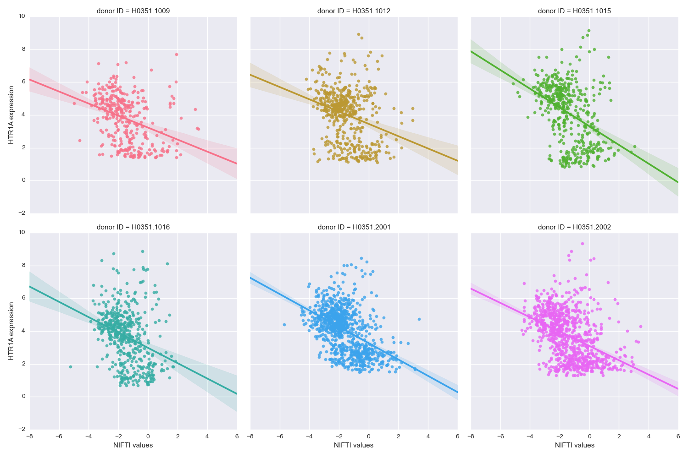

alleninf
========

Compare a statistical map of a brain with gene expression patterns from [Allen Human Brain Atlas](http://human.brain-map.org/).

Usage
-----

    usage: alleninf [-h] [--inference_method INFERENCE_METHOD]
                    [--probes_reduction_method PROBES_REDUCTION_METHOD]
                    [--mask MASK] [--radius RADIUS]
                    stat_map gene_name
    
    Compare a statistical map with gene expression patterns from Allen Human Brain
    Atlas.
    
    positional arguments:
      stat_map              Statistical map in the form of a 3D NIFTI file (.nii
                            or .nii.gz) in MNI space.
      gene_name             Name of the gene you want to compare your map with.
                            For list of all available genes see: http://help
                            .brain-map.org/download/attachments/2818165/HBA_ISH_Ge
                            neList.pdf?version=1&modificationDate=1348783035873.
    
    optional arguments:
      -h, --help            show this help message and exit
      --inference_method INFERENCE_METHOD
                            Which model to use: fixed - fixed effects,
                            approximate_random - approximate random effects
                            (default).
      --probes_reduction_method PROBES_REDUCTION_METHOD
                            How to combine multiple probes: average (default) or
                            pca - use first principal component.
      --mask MASK           Explicit mask for the analysis in the form of a 3D
                            NIFTI file (.nii or .nii.gz) in the same space and
                            dimensionality as the stat_map. If not used an
                            implicit mask (non zero and non NaN voxels) will be
                            used.
      --radius RADIUS       Radius in mm of of the sphere used to average
                            statistical values at the location of each
                            probe.(default: 4mm).

Example
-------

    $ alleninf SetA-SetB_Tstat.nii.gz HTR1A --mask SetA_mean.nii.gz

    Fetching probe ids for gene HTR1A
    Found 3 probes: A_24_P97687, CUST_575_PI417557136, CUST_15880_PI416261804
    Fetching expression values for probes A_24_P97687, CUST_575_PI417557136, CUST_15880_PI416261804
    Found data from 3702 wells sampled across 6 donors
    Combining information from selected probes
    Translating locations of the wells to MNI space
    Checking values of the provided NIFTI file at well locations
    70 wells fall outside of the mask
    Performing approximate random effect analysis
    Correlation between NIFTI values and HTR1A expression averaged across donors = -0.372743 (t=-12.8453, p=5.0909e-05)
    

